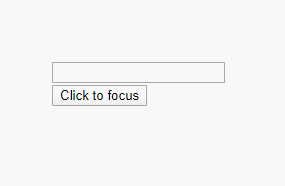
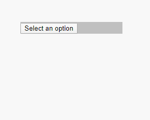

# 1.Accessibility：无障碍

#### 1.为什么使用无障碍辅助功能？
- 无障碍辅助功能是使得辅助技术正确解读网页的必要条件。

#### 2.标准和指南
-  WCAG
  - [网络内容无障碍指南（Web Content Accessibility Guidelines，WCAG）](https://www.w3.org/WAI/intro/wcag) 为开发无障碍网站提供了指南。
- WAI-ARIA
  -  [网络无障碍倡议 - 无障碍互联网应用（Web Accessibility Initiative - Accessible Rich Internet Applications）](https://www.w3.org/WAI/intro/aria) 文件包含了创建完全无障碍 JavaScript 部件所需要的技术。 

> 注意： JSX 支持所有 `aria-*` HTML 属性 

```javascript
<input
  type="text"
  aria-label={labelText}
  aria-required="true"
  onChange={onchangeHandler}
  value={inputValue}
  name="name"
/>
```


#### 3.语义化的HTML

- 语义化的 HTML 是无障碍辅助功能网络应用的基础。  

-  利用多种 HTML 元素来强化您网站中的信息通常可以使您直接获得无障碍辅助功能。 

- 示例： 

  - 1.使用 [React Fragments](https://react.docschina.org/docs/fragments.html) 来组合各个组件 

    ```javascript
    import { Fragment } from 'react'
    
    function ListItem ({ item }) {
      return (
        <Fragment>
          <dt>{ item.term }</dt>
          <dd>{ item.description }</dd>
        </Fragment>
      )
    }
    
    function Glossary (props) {
      return (
        <dl>
          {
            props.items.map(item => (
              <ListItem item={item} key={item.id} />
            ))
          }
        </dl>
      )
    }
    
    
    function App2 () {
      const items = [
        { id: 1, term: 'vue', description: 'hello vue' },
        { id: 2, term: 'react', description: 'hello react' }
      ]
    
      return (
        <Glossary items={ items } />
      )
    }
    
    export default App2;
    ```

    

  - 2.可以把一系列的对象映射到一个 fragment 的数组中 

    ```javascript
    function Glossary(props) {
      return (
        <dl>
          {props.items.map(item => (
            // Fragments should also have a `key` prop when mapping collections
            <Fragment key={item.id}>
              <dt>{item.term}</dt>
              <dd>{item.description}</dd>
            </Fragment>
          ))}
        </dl>
      );
    }
    ```

  - 3.当不需要在 fragment 标签中添加任何 prop 且你的工具支持的时候，可以使用 [短语法](https://react.docschina.org/docs/fragments.html#short-syntax)： 

    ```javascript
    function ListItem({ item }) {
      return (
        <>
          <dt>{item.term}</dt>
          <dd>{item.description}</dd>
        </>
      );
    }
    ```

#### 4.无障碍表单

- 标记

  -  所有的 HTML 表单控制，例如 `<input>` 和 `<textarea>` ，都需要被标注来实现无障碍辅助功能。 

  - `for`在JSX中被写作`htmlFor`

    ```javascript
    <label htmlFor="namedInput">Name:</label>
    <input id="namedInput" type="text" name="name"/>
    ```

- 在出错时提醒用户

- 控制焦点

- 键盘焦点及焦点轮廓

- 跳过内容机制

- 使用程序管理焦点

  - 用 [DOM 元素的 Refs](https://react.docschina.org/docs/refs-and-the-dom.html) 在 React 中设置焦点 
  
    ```javascript
    // 使用程序管理焦点
    class CustomTextInput extends React.Component {
      constructor (props) {
        super(props)
    
        
        // 创造一个textInput DOM元素的ref
        this.textInput = React.createRef()
        
        this.focus = this.focus.bind(this)
      }
    
      // 在需要时设置焦点到组件上
      focus () {
        this.textInput.current.focus()
      }
    
      // 使用`ref`回调函数以在实例的一个变量中存储文本输入DOM元素
      // (比如：this.textInput)
      render () {
        return (
          <div>
            <input type="text" ref={ this.textInput } />
            <span onClick={ this.focus }>click me</span>
          </div>
        )
      }
    }
    
    export default CustomTextInput
    ```
  
  - 有时，父组件需要把焦点设置在其子组件的一个元素上。我们可以通过在子组件上设置一个特殊的 prop 来[对父组件暴露 DOM refs](https://react.docschina.org/docs/refs-and-the-dom.html#exposing-dom-refs-to-parent-components) 从而把父组件的 ref 传向子节点的 DOM 节点。
  
    ```javascript
    // 在子组件设置一个特殊prop来对父组件暴露DOM refs
    function CustomeTextInput2 (props) {
      return (
        <div>
          <input ref={ props.inputRef } />
        </div>
      )
    }
    
    class Parent extends React.Component {
      constructor (props) {
        super(props)
    
        this.inputElement = React.createRef()
        this.focus = this.focus.bind(this)
      }
    
      // 挂载时设置焦点
      componentDidMount () {
        this.focus()
      }
      
      focus () {
        this.inputElement.current.focus()
      }
    
      render () {
        return (
          <>
            <CustomeTextInput2 inputRef={ this.inputElement } />
            <button onClick={ this.focus }>Click to focus</button>
          </>
        )
      }
    }
    
    export default Parent
    ```
  
    
  
- 焦点管理示例插件：[react-aria-modal](https://github.com/davidtheclark/react-aria-modal)


#### 5.鼠标和指针事件

> 确保任何可以使用鼠标和指针完成的功能也可以只通过键盘完成。

- 示例1：`click`事件

  ```javascript
  class OuterClickExample extends React.Component {
    constructor (props) {
      super(props)
  
      this.state = { isOpen: false }
      this.toggleContainer = React.createRef()
  
      this.onClickHandle = this.onClickHandle.bind(this)
      this.onClickOutsideHandler = this.onClickOutsideHandler.bind(this)
    }
  
    componentDidMount () {
      window.addEventListener('click', this.onClickOutsideHandler)
    }
  
    componentWillMount () {
      window.addEventListener('click', this.onClickOutsideHandler)
    }
  
    onClickHandle () {
      this.setState(currentState => ({
        isOpen: !currentState.isOpen
      }))
    }
  
    onClickOutsideHandler (event) {
      if (this.state.isOpen && !this.toggleContainer.current.contains(event.target)) {
        this.setState({ isOpen: false })
      }
    }
  
    render () {
      return (
        <div ref={ this.toggleContainer }>
          <button onClick={ this.onClickHandle }>Select an option</button>
          {
            this.state.isOpen && (
              <ul>
                <li>Option 1</li>
                <li>Option 2</li>
                <li>Option 3</li>
              </ul>
            )
          }
        </div>
      )
    }
  }
  
  ```

  

- 示例2：`onBlur`、`onFocus`

  ```javascript
  class BlurExample extends React.Component {
    constructor(props) {
      super(props)
  
      this.state = { isOpen: false }
      this.timeOutId = null
  
      this.onClickHandler = this.onClickHandler.bind(this)
      this.onBlurHandler = this.onBlurHandler.bind(this)
      this.onFocusHandler = this.onFocusHandler.bind(this)
    }
  
    onClickHandler() {
      this.setState(currentState => ({
        isOpen: !currentState.isOpen,
      }))
    }
  
    onBlurHandler() {
      this.timeOutId = setTimeout(() => {
        this.setState({
          isOpen: false,
        })
      })
    }
  
    onFocusHandler() {
      clearTimeout(this.timeOutId)
    }
  
    render() {
      return (
        <div onBlur={this.onBlurHandler} onFocus={this.onFocusHandler}>
          <button
            onClick={this.onClickHandler}
            aria-haspopup="true"
            aria-expanded={this.state.isOpen}>
            Select an option
          </button>
          {this.state.isOpen && (
            <ul>
              <li>Option1</li>
              <li>Option2</li>
              <li>Option3</li>
            </ul>
          )}
        </div>
      )
    }
  }
  ```

  

#### 6.更复杂的部件

#### 7.其他考虑因素

- #####设置语言

- #####设置文档标题

  - 可以使用 [React 文档标题组件（React Document Title Component）](https://github.com/gaearon/react-document-title)来设置标题

- #####色彩对比度

#### 8.开发及测试

- #####键盘

  - 断开鼠标
  - 使用 `Tab` 和 `Shift+Tab` 来浏览。
  - 使用 `Enter` 来激活元素。
  - 当需要时，使用键盘上的方向键来和某些元素互动，比如菜单和下拉选项。

- #####开发辅助

  - `eslint-plugin-jsx-a11y`插件

  - 启用更多的无障碍规则，可以在项目的根目录中创建一个有如下内容的 `.eslintrc` 文件：

    ```javascript
    {
      "extends": ["react-app", "plugin:jsx-a11y/recommended"],
      "plugins": ["jsx-a11y"]
    }
    ```

- #####在浏览器中测试无障碍辅助功能

  - `aXe`、`aXe-core`、`react-axe`
  - `WebAIM WAVE`
  - 无障碍辅助功能检测器和无障碍辅助功能树

- #####屏幕朗读器

- #####常用屏幕朗读器

  - 火狐中的 NVDA
  - Safari 中的 VoiceOver
  -  Internet Explorer 中的 JAWS
  -  Google Chrome 中的 ChromeVox


