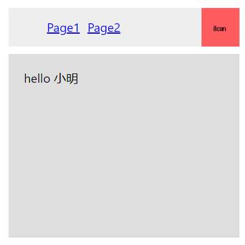
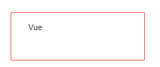
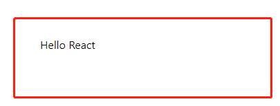
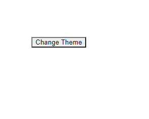

# 3.Context

> Context提供了一个无需为每层组件手动添加props，就能在组件树间进行数据传递的方法。


## 1.何时使用Context

> ```Context```设计目的是为了共享那些对于一个组件树而言是“全局”的数据。

### 1.1 传统写法

```javascript
import React from 'react'

function App() {
  return <Toolbar theme="dark" />
}

function Toolbar(props) {
  return (
    <div>
      <ThemButton theme={props.theme} />
    </div>
  )
}

class ThemButton extends React.Component {
  render() {
    return <Button theme={this.props.theme} />
  }
}

function Button(props) {
  return <button className={props.theme}>Props自上而下传递</button>
}

export default App

```


### 1.2 使用context

```javascript
import React from 'react'

// 为当前theme创建一个context(默认值：light)
const ThemeContext = React.createContext('light')

class App extends React.Component {
  render() {
    // 使用一个Provider来将当前的 theme 传递给以下的组件树
    // 将“dark”作为当前值传递下去
    return (
      <ThemeContext.Provider value="dark">
        <Toolbar />
      </ThemeContext.Provider>
    )
  }
}

function Toolbar() {
  return (
    <div>
      <ThemedButton />
    </div>
  )
}

class ThemedButton extends React.Component {
  // 指定 contextType 读取当前 theme context
  static contextType = ThemeContext
  render() {
    return <Button theme={this.context} />
  }
}

function Button(props) {
  return <button className={props.theme}>Context</button>
}

export default App

```


## 2.使用Context之前的考虑

> Context主要应用场景在于很多不同层级的组件需要访问同样的一些数据。需要谨慎使用，因为这样会使得组件的**复用性变差**。

> **如果你只是想避免层层传递一些属性，[组件组合（component composition）](https://react.docschina.org/docs/composition-vs-inheritance.html)有时候是一个比 context 更好的解决方案。**

### 2.1 `组件组合`创建`Page`组件示例



```javascript
import React from 'react'
import './Demo3.css'

function Feed(props) {
  return <div>hello {props.user.name}</div>
}

function Avatar(props) {
  return (
    <div>
      
    </div>
  )
}

function Link(props) {
  return (
    <a href={props.href} className="avatar-link">
      {props.children}
    </a>
  )
}

function NavigationBar(props) {
  return (
    <div>
      <ul>
        <li>
          <a href="#">Page1</a>
        </li>
        <li>
          <a href="#">Page2</a>
        </li>
      </ul>
      {props.children}
    </div>
  )
}

function PageLayout(props) {
  return (
    <div>
      <div className="navigation-bar">{props.topBar}</div>
      <div className="content">{props.content}</div>
    </div>
  )
}

function Page(props) {
  const user = props.user
  const content = <Feed user={user} />
  const topBar = (
    <NavigationBar>
      <Link href={user.permalink}>
        <Avatar user={user} size={props.avatarSize} />
      </Link>
    </NavigationBar>
  )

  return <PageLayout topBar={topBar} content={content} />
}

const App = () => {
  const user = {
    name: '小明',
    permalink: 'http://www.toutiao.com',
    avatar: 'http://placehold.it/50x50/FF5C60/000000?text=itcan',
  }
  return <Page user={user} avatarSize="50px" />
}

export default App

```

## 3.API

### 3.1 ```React.createContext```

- #### 语法：

```javascript
const MyContext = React.createContext(defaultValue);
```

> - 创建一个 Context 对象。当 React 渲染一个订阅了这个 Context 对象的组件，这个组件会从组件树中离自身最近的那个匹配的 `Provider` 中读取到当前的 context 值。
> - **只有**当组件所处的树中没有匹配到 Provider 时，其 `defaultValue` 参数才会生效。这有助于在不使用 Provider 包装组件的情况下对组件进行测试。注意：将 `undefined` 传递给 Provider 的 value 时，消费组件的 `defaultValue` 不会生效。

- #### 示例：

```javascript
// Context API

import React from 'react'

const MyContext = React.createContext('React')

function App() {
  return (
    <MyContext.Provider value="Vue">
      <FrontFramework />
    </MyContext.Provider>
  )
}

function FrontFramework() {
  return <Hello />
}

class Hello extends React.Component {
  // static contextType = MyContext

  render() {
    // return <div>Hello, {this.context}</div>
    return (
      <MyContext.Consumer>{value => <div>{value}</div>}</MyContext.Consumer>
    )
  }
}

export default App

```



### 3.2 ```Context.Provider```

- #### 语法：

```javascript
<MyContext.Provider value={/* 某个值 */}>
```

> - 每个 Context 对象都会返回一个 Provider React 组件，它允许消费组件订阅 context 的变化。
>
> - Provider 接收一个 `value` 属性，传递给消费组件。一个 Provider 可以和多个消费组件有对应关系。多个 Provider 也可以嵌套使用，里层的会覆盖外层的数据。
>
> - 当 Provider 的 `value` 值发生变化时，它内部的所有消费组件都会重新渲染。Provider 及其内部 consumer 组件都不受制于 `shouldComponentUpdate` 函数，因此当 consumer 组件在其祖先组件退出更新的情况下也能更新。


### 3.3 ```Class.contextType```

> 挂载在 class 上的 `contextType` 属性会被重赋值为一个由 [`React.createContext()`](https://react.docschina.org/docs/context.html#reactcreatecontext) 创建的 Context 对象。这能让你使用 `this.context` 来消费最近 Context 上的那个值。你可以在任何生命周期中访问到它，包括 render 函数中。

```javascript
// Class.contextType

import React from 'react'

const MyContext = React.createContext('React')

class App extends React.Component {
  componentDidMount() {
    let value = this.context
    console.log(value, 'componentDidMount')
  }

  componentDidUpdate() {
    let value = this.context
    console.log(value, 'componentDidUpdate')
  }

  componentWillUnmount() {
    let value = this.context
    console.log(value, 'componentWillUnmount')
  }

  render() {
    let value = this.context
    return <div>Hello {value}</div>
  }
}
App.contextType = MyContext

export default App

```

> 如果你正在使用实验性的 [public class fields 语法](https://babeljs.io/docs/plugins/transform-class-properties/)，你可以使用 `static` 这个类属性来初始化你的 `contextType`。

```javascript
// Class.contextType

import React from 'react'

const MyContext = React.createContext('React')

class App extends React.Component {
  static contextType = MyContext
  render() {
    let value = this.context
    return <div>Hello {value}</div>
  }
}

export default App

```


### 3.4 ```Context.Consumer```

#### 语法：

```javascript
<MyContext.Consumer>
  {value => /* 基于 context 值进行渲染*/}
</MyContext.Consumer>
```

> 这需要[函数作为子元素（function as a child）](https://react.docschina.org/docs/render-props.html#using-props-other-than-render)这种做法。这个函数接收当前的 context 值，返回一个 React 节点。传递给函数的 `value` 值等同于往上组件树离这个 context 最近的 Provider 提供的 `value` 值。如果没有对应的 Provider，`value` 参数等同于传递给 `createContext()` 的 `defaultValue`。

```javascript
// Context.Consumer
import React from 'react'

const MyContext = React.createContext('React')

class App extends React.Component {
  render() {
    return (
      <MyContext.Consumer>
        {value => <div>Hello {value}</div>}
      </MyContext.Consumer>
    )
  }
}

export default App

```




### 3.5 ```Context.displayName```

> context 对象接受一个名为 `displayName` 的 property，类型为字符串。React DevTools 使用该字符串来确定 context 要显示的内容。

```javascript
const MyContext = React.createContext(/* some value */);
MyContext.displayName = 'MyDisplayName';

<MyContext.Provider> // "MyDisplayName.Provider" 在 DevTools 中
<MyContext.Consumer> // "MyDisplayName.Consumer" 在 DevTools 中
```


## 4.示例

### 4.1 动态Context

```javascript
// theme-context.js
import React from 'react'

export const themes = {
  light: {
    foreground: '#000000',
    background: '#eeeeee',
  },
  dark: {
    foreground: '#ffffff',
    background: '#222222',
  },
}

export const ThemeContext = React.createContext(themes.dark)

```

```javascript
// theme-button.js
import React from 'react'
import { ThemeContext } from './theme-context'

class ThemedButton extends React.Component {
  render() {
    let props = this.props
    let theme = this.context

    return <button {...props} style={{ backgroundColor: theme.background }} />
  }
}

ThemedButton.contextType = ThemeContext

export default ThemedButton

```

```javascript
// App.js
// dynamic Context
import React from 'react'
import { ThemeContext, themes } from './theme-context'
import ThemedButton from './themed-button'

function Toolbar(props) {
  return <ThemedButton onClick={props.changeTheme}>Change Theme</ThemedButton>
}

class App extends React.Component {
  constructor(props) {
    super(props)
    this.state = {
      theme: themes.light,
    }

    this.toggleTheme = () => {
      this.setState(state => ({
        theme: state.theme === themes.dark ? themes.light : themes.dark,
      }))
    }
  }
  render() {
    return (
      <div>
        <ThemeContext.Provider value={this.state.theme}>
          <Toolbar changeTheme={this.toggleTheme} />
        </ThemeContext.Provider>
      </div>
    )
  }
}

export default App

```



###  4.2 在嵌套组件中更新Context

```javascript
// theme-context.js
import React from 'react'

export const themes = {
  light: {
    foreground: '#000000',
    background: '#eeeeee',
  },
  dark: {
    foreground: '#ffffff',
    background: '#222222',
  },
}

// 确保传递给 createContext 的默认值数据结构是调用的组件 （consumers）所能匹配的！
export const ThemeContext = React.createContext({
  theme: themes.dark,
  toggleTheme: () => {},
})

```

```javascript
// theme-toggler-button.js
import React from 'react'
import { ThemeContext } from './theme-context'

function ThemeTogglerButton() {
  return (
    <ThemeContext.Consumer>
      {({ theme, toggleTheme }) => (
        <button
          onClick={toggleTheme}
          style={{ backgroundColor: theme.background }}
        >
          Toggle Theme
        </button>
      )}
    </ThemeContext.Consumer>
  )
}

export default ThemeTogglerButton

```

```javascript
// App.js
import React from 'react'
import { ThemeContext, themes } from './theme-context'
import ThemeTogglerButton from './theme-toggler-button'

class App extends React.Component {
  constructor(props) {
    super(props)

    this.toggleTheme = () => {
      this.setState(state => ({
        theme: state.theme === themes.dark ? themes.light : themes.dark,
      }))
    }

    this.state = {
      theme: themes.light,
      toggleTheme: this.toggleTheme,
    }
  }

  render() {
    return (
      <ThemeContext.Provider value={this.state}>
        <ThemeTogglerButton />
      </ThemeContext.Provider>
    )
  }
}

export default App

```


### 4.3 使用多个Context

```javascript
// Theme context，默认的 theme 是 “light” 值
const ThemeContext = React.createContext('light');

// 用户登录 context
const UserContext = React.createContext({
  name: 'Guest',
});

class App extends React.Component {
  render() {
    const {signedInUser, theme} = this.props;

    // 提供初始 context 值的 App 组件
    return (
      <ThemeContext.Provider value={theme}>
        <UserContext.Provider value={signedInUser}>
          <Layout />
        </UserContext.Provider>
      </ThemeContext.Provider>
    );
  }
}

function Layout() {
  return (
    <div>
      <Sidebar />
      <Content />
    </div>
  );
}

// 一个组件可能会消费多个 context
function Content() {
  return (
    <ThemeContext.Consumer>
      {theme => (
        <UserContext.Consumer>
          {user => (
            <ProfilePage user={user} theme={theme} />
          )}
        </UserContext.Consumer>
      )}
    </ThemeContext.Consumer>
  );
}
```


## 5.注意事项

> 因为 context 会使用参考标识（reference identity）来决定何时进行渲染，这里可能会有一些陷阱，当 provider 的父组件进行重渲染时，可能会在 consumers 组件中触发意外的渲染。举个例子，当每一次 Provider 重渲染时，以下的代码会重渲染所有下面的 consumers 组件，因为 `value` 属性总是被赋值为新的对象：

```javascript
class App extends React.Component {
  render() {
    return (
      <MyContext.Provider value={{something: 'something'}}>
        <Toolbar />
      </MyContext.Provider>
    );
  }
}
```

> 为了防止这种情况，将 value 状态提升到父节点的 state 里：

```javascript
class App extends React.Component {
  constructor(props) {
    super(props);
    this.state = {
      value: {something: 'something'},
    };
  }

  render() {
    return (
      <Provider value={this.state.value}>
        <Toolbar />
      </Provider>
    );
  }
}
```


## 6.废弃的API

