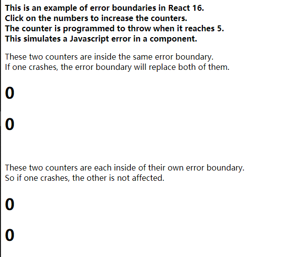
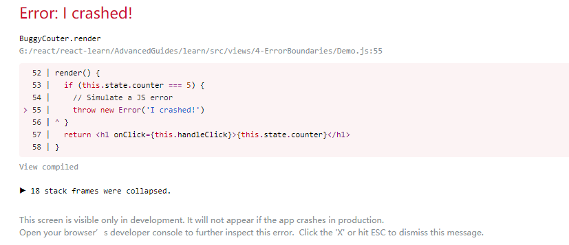

# 4.错误边界

## 1.错误边界

### 概念：

- 错误边界是一种React组件，这种组件**可以捕获并打印发生在其子组件树任何位置的Javascript错误，并且，它会渲染出备用UI**，而不是渲染那些崩溃了的子组件树。
- 错误边界在渲染期间、生命周期方法和整个组件树的构造函数中捕获错误。

> **注意**
>
> 错误边界特点：
>
> - 只有 class 组件才可以成为错误边界组件
> - **错误边界仅可以捕获其子组件的错误**，它无法捕获其自身的错误
> - 如果一个错误边界无法渲染错误信息，则错误会冒泡至最近的上层错误边界
>
> 错误边界无法捕获以下场景中产生的错误：
>
> - 事件处理
> - 异步代码
> - 服务端渲染
> - 它自身抛出来的错误（并非它的子组件）

### 用法：

如果一个 class 组件中定义了 [`static getDerivedStateFromError()`](https://react.docschina.org/docs/react-component.html#static-getderivedstatefromerror) 或 [`componentDidCatch()`](https://react.docschina.org/docs/react-component.html#componentdidcatch) 这两个生命周期方法中的任意一个（或两个）时，那么它就变成一个错误边界。当抛出错误后，请使用 `static getDerivedStateFromError()` 渲染备用 UI ，使用 `componentDidCatch()` 打印错误信息。

```javascript
class ErrorBoundary extends React.Component{
  constructor(props) {
    super(props)
    this.state = { hasError: false }
  }

  static getDerivedStateFromError(error) {
    // 更新 state 使下一次渲染能够显示降级后的UI
    return { hasError: true }
  }

  componentDidCatch(error, errorInfo) {
    // 处理错误信息
    console.log(error, errorInfo)
  }

  render() {
    if(this.state.hasError) {
      // 自定义降级后的UI并渲染
      return <h1>Something went wrong.</h1>
    }

    return this.props.children
  }
}
```

将它作为一个常规组件去使用：

```javascript
<ErrorBoundary>
  <MyWidget />
</ErrorBoundary>
```


## 2.示例：

```javascript
<!DOCTYPE html>
<html lang="en">
<head>
  <meta charset="UTF-8">
  <meta name="viewport" content="width=device-width, initial-scale=1.0">
  <title>Error Boundaries</title>
</head>
<body>
  <div id="root"></div>

  <script src="https://unpkg.com/react@16/umd/react.production.min.js" crossorigin></script>
  <script src="https://unpkg.com/react-dom@16/umd/react-dom.production.min.js" crossorigin></script>
  <script src="https://unpkg.com/babel-standalone@6/babel.min.js" ></script>

  <script type="text/babel">
    class ErrorBoundary extends React.Component {
      constructor(props) {
        super(props)
        this.state = { error: null, errorInfo: null }
      }

      componentDidCatch(error, errorInfo) {
        // Catch errors in any components below and re-render with error message
        this.setState({
          error: error,
          errorInfo: errorInfo
        })

        // You can also log error messages to an error reporting service here
      }

      render() {
        if (this.state.errorInfo) {
          // Error path
          return (
            <div>
              <h2>Something went wrong.</h2>  
              <details style={{ whiteSpace: 'pre-wrap' }}>
                {this.state.error && this.state.error.toString()}
                <br/>
                {this.state.errorInfo.componentStack}
              </details>
            </div>
          )
        }

        // Normally, just render children
        return this.props.children
      }
    }

    class BuggyCouter extends React.Component {
      constructor(props) {
        super(props)
        this.state = { counter: 0 }
        this.handleClick = this.handleClick.bind(this)
      }

      handleClick() {
        this.setState(({counter}) => ({
          counter: counter + 1
        }))
      }

      render() {
        if (this.state.counter === 5) {
          // Simulate a JS error
          throw new Error('I crashed!')
        }
        return <h1 onClick={this.handleClick}>{this.state.counter}</h1>
      }
    }

    function App() {
      return (
        <div>
          <p>
            <b>
              This is an example of error boundaries in React 16.<br/>
              Click on the numbers to increase the counters.<br/>
              The counter is programmed to throw when it reaches 5.<br/>
              This simulates a Javascript error in a component.
            </b>
            <br/>
            <ErrorBoundary>
              <p>
                These two counters are inside the same error boundary.<br/>
                If one crashes, the error boundary will replace both of them.
              </p>
              <BuggyCouter />
              <BuggyCouter />
            </ErrorBoundary>
            <br/>
            <p>
              These two counters are each inside of their own error boundary.<br/>
              So if one crashes, the other is not affected.
            </p>
            <ErrorBoundary><BuggyCouter /></ErrorBoundary>
            <ErrorBoundary><BuggyCouter /></ErrorBoundary>
          </p>
        </div>
      )
    }

    ReactDOM.render(
      <App />,
      document.getElementById('root')
    )
  </script>
</body>
</html>
```



## 3.错误边界应该放置在哪？

错误边界的粒度由你来决定，可以将其包装在最顶层的路由组件并为用户展示一个 “Something went wrong” 的错误信息，就像服务端框架经常处理崩溃一样。你也可以将单独的部件包装在错误边界以保护应用其他部分不崩溃。

## 4.组件栈追踪

在开发环境下，React 16 会把渲染期间发生的所有错误打印到控制台，即使该应用意外的将这些错误掩盖。除了错误信息和 JavaScript 栈外，React 16 还提供了组件栈追踪。现在你可以准确地查看发生在组件树内的错误信息：



## 5.关于事件处理器

错误边界**无法**捕获事件处理器内部的错误。

在事件处理器内部捕获错误，使用普通的 JavaScript `try` / `catch` 语句。

```javascript
class MyComponent extends React.Component {
  constructor(props) {
    super(props);
    this.state = { error: null };
    this.handleClick = this.handleClick.bind(this);
  }

  handleClick() {
    try {
      // 执行操作，如有错误则会抛出
    } catch (error) {
      this.setState({ error });
    }
  }

  render() {
    if (this.state.error) {
      return <h1>Caught an error.</h1>
    }
    return <button onClick={this.handleClick}>Click Me</button>
  }
}
```

