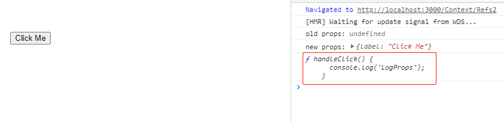
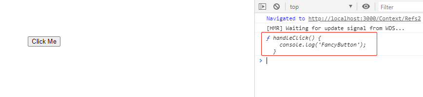
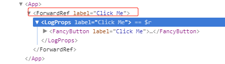
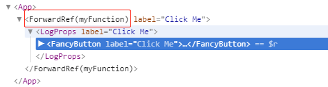
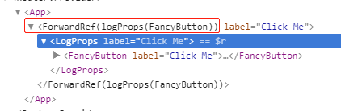

# 5.Refs转发

## 1.什么是Ref转发

Ref转发是一项将ref自动地通过组件传递到其一子组件的技巧。


## 2.转发refs到DOM组件

```javascript
const FancyButton = React.forwardRef((props, ref) => (
  <button ref={ref} className="FancyButton">
    {props.children}
  </button>
))

class App extends React.Component {
  render() {
    // 直接获取 DOM button 的 ref
    const ref = React.createRef()

    return <FancyButton ref={ref}>Click me!</FancyButton>
  }
}
```

使用 `FancyButton` 的组件可以获取底层 DOM 节点 `button` 的 ref ，并在必要时访问，就像其直接使用 DOM `button` 一样。

> 注意
>
> 第二个参数 `ref` 只在使用 `React.forwardRef` 定义组件时存在。常规函数和 class 组件不接收 `ref` 参数，且 props 中也不存在 `ref`。
>
> Ref 转发不仅限于 DOM 组件，你也可以转发 refs 到 class 组件实例中。

## 3.组件库维护者的注意事项

**当你开始在组件库中使用 `forwardRef` 时，你应当将其视为一个破坏性更改，并发布库的一个新的主版本。** 这是因为你的库可能会有明显不同的行为（例如 refs 被分配给了谁，以及导出了什么类型），并且这样可能会导致依赖旧行为的应用和其他库崩溃。

出于同样的原因，当 `React.forwardRef` 存在时有条件地使用它也是不推荐的：它改变了你的库的行为，并在升级 React 自身时破坏用户的应用。


## 4.在高阶组件中转发refs

**从一个输出组件 props 到控制台的 HOC 示例开始：**

```javascript
import React from 'react'
import FancyButton from './FancyButton2'

class App extends React.Component {
  constructor(props) {
    super(props)

    this.ref = React.createRef()
  }

  componentDidMount() {
    console.log(this.ref.current.handleClick)
  }

  render() {
    return <FancyButton label="Click Me" ref={this.ref} />
  }
}

export default App

```


```javascript
// FancyButton.js
import React from 'react'

class FancyButton extends React.Component {
  handleClick() {
    console.log('FancyButton')
  }

  render() {
    return <button>{this.props.label}</button>
  }
}

function logProps(WrappedComponent) {
  class LogProps extends React.Component {
    componentDidMount(prevProps) {
      console.log('old props:', prevProps)
      console.log('new props:', this.props)
    }

    handleClick() {
      console.log('LogProps')
    }

    render() {
      return <WrappedComponent {...this.props} />
    }
  }

  return LogProps
}

export default logProps(FancyButton)

```



- “logProps” HOC 透传（pass through）所有 `props` 到其包裹的组件，所以渲染结果将是相同的
- 有一点需要注意：refs 将不会透传下去。这是因为 `ref` 不是 prop 属性。就像 `key` 一样，其被 React 进行了特殊处理。如果你对 HOC 添加 ref，该 ref 将引用最外层的容器组件，而不是被包裹的组件。
- 这意味着用于我们 `FancyButton` 组件的 refs 实际上将被挂载到 `LogProps` 组件：


```javascript
// FancyButton2.js
import React from 'react'

class FancyButton extends React.Component {
  handleClick() {
    console.log('FancyButton')
  }

  render() {
    return <button>{this.props.label}</button>
  }
}

function logProps(WrappedComponent) {
  class LogProps extends React.Component {
    componentDidUpdate(prevProps) {
      console.log('old props:', prevProps)
      console.log('new props:', this.props)
    }

    handleClick() {
      console.log('LogProps')
    }

    render() {
      const { forwardedRef, ...rest } = this.props

      // 将自定义的 prop 属性 “forwardedRef” 定义为 ref
      return <WrappedComponent ref={forwardedRef} {...rest} />
    }
  }

  // 注意 React.forwardRef 回调的第二个参数“ref”
  // 可以将其作为常规 prop 属性传递给 LogProps,例如“forwardedRef”
  // 然后它就可以被挂载到被 LogProps 包裹的子组件上
  return React.forwardRef((props, ref) => {
    return <LogProps {...props} forwardedRef={ref} />
  })
}

export default logProps(FancyButton)

```



## 5.在 DevTools 中显示自定义名称

`React.forwardRef` 接受一个渲染函数。React DevTools 使用该函数来决定为 ref 转发组件显示的内容。


####1.例如，以下组件将在 DevTools 中显示为 “*ForwardRef*”：

```javascript
  return React.forwardRef((props, ref) => {
    return <LogProps {...props} forwardedRef={ref} />
  })
```




#### 2.如果你命名了渲染函数，DevTools 也将包含其名称（例如 “*ForwardRef(myFunction)*”）：

```javascript
  return React.forwardRef(function myFunction(props, ref) {
    return <LogProps {...props} forwardedRef={ref} />
  })
```




#### 3.你甚至可以设置函数的 `displayName` 属性来包含被包裹组件的名称：

```javascript
  function forwardRef(props, ref) {
    return <LogProps {...props} forwardedRef={ref} />
  }

  // 在 DevTools 中为该组件提供一个更有用的显示名
  // 例如 “ForwardRef(logProps(MyComponent))”
  const name = WrappedComponent.displayName || WrappedComponent.name
  forwardRef.displayName = `logProps(${name})`

  return React.forwardRef(forwardRef)
```


