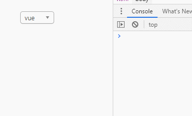
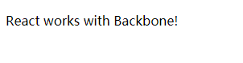

# 8.与第三方库协同

## 1.集成带有 DOM 操作的插件

>  React 不会理会 React 自身之外的 DOM 操作。它根据内部虚拟 DOM 来决定是否需要更新，而且如果同一个 DOM 节点被另一个库操作了，React 会觉得困惑而且没有办法恢复。
>
> 避免冲突的最简单方式就是防止 React 组件更新。你可以渲染无需更新的 React 元素，比如一个空的 `<div>`。

### 1.1引入Jquery

**安装：**`npm install jquery -S`

**代码：**

```javascript
import React from 'react'
import $ from 'jquery'

class App extends React.Component {
  componentDidMount() {
    this.$el = $(this.el)
    this.$el.html('hello world')
  }

  render() {
    return <div ref={el => (this.el = el)} />
  }
}

export default App

```

**思路：**

- 从`render`函数返回一个空的`<div/>`【目的：防止React挂载后触碰这个DOM】
- 添加一个`Ref`到根DOM元素

### 1.2集成Jquery Chosen插件

**安装：**`npm install jquery-chosen -S`

**代码：**

```javascript
import React, { Component } from 'react'
import $ from 'jquery'
import 'jquery-chosen/chosen.min.css'

window.jQuery = $
require('jquery-chosen/chosen.jquery')

class Chosen extends React.Component {
  componentDidMount() {
    this.$el = $(this.el)
    this.$el.chosen()

    this.handleChange = this.handleChange.bind(this)
    this.$el.on('change', this.handleChange)
  }
  
	componentDidUpdate(prevProps) {
    if (prevProps.children !== this.props.children) {
      this.$el.trigger("chosen:updated");
    }
  }
  
  componentWillUnmount() {
    this.$el.off('change', this.handleChange)
    this.$el.chosen('destroy')
  }

  handleChange(e) {
    this.props.onChange(e.target.value)
  }

  render() {
    return (
      <div>
        <select className="Chosen-select" ref={el => (this.el = el)}>
          {this.props.children}
        </select>
      </div>
    )
  }
}

function Example() {
  return (
    <Chosen onChange={value => console.log(value)}>
      <option>vue</option>
      <option>react</option>
      <option>angular</option>
    </Chosen>
  )
}

export default Example

```

**思路：**

- `Chosen`紧挨着`<select>`节点追加一个DOM元素

- 使用额外的`<div>`将`<select>`包裹起来
- 确保React更新不会和`Chosen`追加的额外DOM节点发生冲突

**效果：**




## 2.和其他视图库集成

### 2.1利用 React 替换基于字符串的渲染

**jquery实现：**

```javascript
$('#container').html('<button id="btn">Say Hello</button>');
$('#btn').click(function() {
  alert('Hello!');
});
```

**React实现：**

```javascript
function Button(props) {
  return <button onClick={props.onClick}>Say Hello</button>
}

function HelloButton() {
  function handleClick() {
    alert('Hello')
  }
  return <Button onClick={handleClick} />
}

export default HelloButton
```

###2.2把 React 嵌入到 Backbone 视图

```javascript
<!DOCTYPE html>
<html lang="en">
<head>
  <meta charset="UTF-8">
  <meta name="viewport" content="width=device-width, initial-scale=1.0">
  <title>8.与第三方库协同</title>
</head>
<body>
  <div id="app"></div>

  <script src="https://unpkg.com/react@16/umd/react.production.min.js" crossorigin></script>
  <script src="https://unpkg.com/react-dom@16/umd/react-dom.production.min.js" crossorigin></script>
  <script src="https://unpkg.com/babel-standalone@6/babel.min.js" ></script>
  <script src="https://cdnjs.cloudflare.com/ajax/libs/jquery/3.1.0/jquery.min.js"></script>
  <script src="https://cdnjs.cloudflare.com/ajax/libs/underscore.js/1.8.3/underscore-min.js"></script>
  <script src="../../plugins/backbone-min.js"></script>

  <script type="text/babel">
    function Paragraph(props){
      return <p>{props.text}</p>
    }

    const ParagraphView = Backbone.View.extend({
      render() {
        const text = this.model.get('text')
        ReactDOM.render(
          <Paragraph text={text} />,
          this.el
        )
        return this
      },

      remove() {
        ReactDOM.unmountComponentAtNode(this.el)
        Backbone.View.prototype.remove.call(this)
      }
    })

    const model = new Backbone.Model({ text: 'React works with Backbone!'})
    const view = new ParagraphView({ model, el: '#app' })
    view.render()
  </script>
</body>
</html>
```

